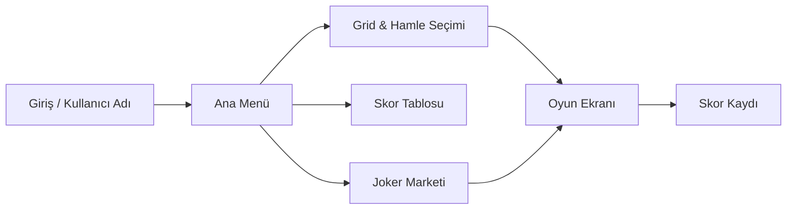

# Word Crush

[](https://kotlinlang.org/)
[](https://developer.android.com/)
[](https://developer.android.com/)
[](#lisans)

**Word Crush**, harflerden oluşan bir grid üzerinde komşu harfleri birleştirerek geçerli Türkçe kelimeler oluşturduğunuz, puan topladığınız ve jokerlerle stratejinizi geliştirdiğiniz bir Android kelime bulmaca oyunudur.

> Yazlab 5 dersi kapsamında geliştirilmiş eğitim amaçlı bir mobil oyun projesidir.

---

## İçindekiler

- [Oyun Hakkında](#oyun-hakkında)
- [Özellikler](#özellikler)
- [Nasıl Oynanır?](#nasıl-oynanır)
- [Jokerler](#jokerler)
- [Güç Harfleri](#güç-harfleri)
- [Puan Sistemi](#puan-sistemi)
- [Ekran Görüntüleri](#ekran-görüntüleri)
- [Teknolojiler](#teknolojiler)
- [Kurulum](#kurulum)
- [Proje Yapısı](#proje-yapısı)
- [Mimari Notlar](#mimari-notlar)
- [Lisans](#lisans)

---

## Oyun Hakkında

Word Crush, Boggle ve Word Crush tarzı oyunlardan ilham alan, tamamen **Türkçe karakter desteği** (Ç, Ğ, İ, Ö, Ş, Ü) ile çalışan bir kelime oyunudur. Oyuncu parmakla komşu harfleri seçerek en az 3 harfli kelimeler oluşturur; geçerli kelimeler patlar, yerçekimi ile yeni harfler düşer ve kalan hamle sayısı azalır.

Oyun sonunda skor, kelime sayısı, en uzun kelime ve süre **SQLite** veritabanına kaydedilir.



---

## Özellikler

| Kategori | Detay |
|----------|-------|
| **Grid boyutları** | 6×6, 8×8, 10×10 |
| **Hamle limiti** | 15 (zor), 20 (orta), 25 (kolay) |
| **Sözlük** | ~76.000 Türkçe kelime (`words_tr.txt`) |
| **Kelime doğrulama** | HashSet + prefiks optimizasyonu |
| **Combo sistemi** | Kelime içindeki alt kelimelerin puanları toplanır |
| **Güç harfleri** | 4–7 harfli kelimeler özel patlama gücü bırakır |
| **Joker marketi** | 6 farklı joker, altın ile satın alma |
| **Skor tablosu** | Oyun geçmişi ve özet istatistikler |
| **Arka plan müziği** | Döngüsel soundtrack desteği |
| **Akıllı grid** | Geçerli kelime yoksa tablo otomatik yenilenir |

---

## Nasıl Oynanır?

1. **Kullanıcı adınızı** girin ve kaydedin.
2. **Yeni Oyun** → grid boyutu ve hamle sayısını seçin.
3. Grid üzerinde **komşu harflere** (çapraz dahil) parmağınızı sürükleyerek kelime oluşturun.
4. Parmağınızı kaldırdığınızda kelime doğrulanır:
   - **Geçerli:** Harfler patlar, puan kazanırsınız, yerçekimi devreye girer.
   - **Geçersiz:** Hamle yine de harcanır, puan alınmaz.
5. Hamleler bitince veya oyundan çıkınca skor kaydedilir.

**İpuçları:**
- Geri adım atmak için seçimin **bir önceki harfine** tekrar dokunun.
- Joker kullanmak için joker butonuna **iki kez** hızlıca dokunun.
- Uzun basarak joker açıklamasını görebilirsiniz.
- Oyun ekranındaki gizli menüden griddeki tüm geçerli kelimeleri listeleyebilirsiniz.

---

## Jokerler

Marketten altın harcayarak satın alınır; oyunda çift dokunuşla aktive edilir.

| Joker | Fiyat | Etki |
|-------|------:|------|
| 🐟 **Balık** | 100 | Gridde rastgele 3–7 harfi yok eder |
| 🍭 **Lolipop Kırıcı** | 75 | Seçilen tek harfi yok eder |
| 🔄 **Serbest Değiştirme** | 125 | Komşu iki harfin yerini değiştirir |
| ⚙️ **Tekerlek** | 200 | Seçilen harfin satır ve sütunundaki tüm harfleri yok eder |
| 🔀 **Harf Karıştırma** | 300 | Mevcut harfleri yer değiştirir (güçler korunur) |
| 🎉 **Parti Güçlendiricisi** | 400 | Tüm harfleri temizler ve tabloyu yeniler |

Başlangıç altını: **50.000**

---

## Güç Harfleri

Uzun kelimeler, son harfte kalıcı bir güç bırakır. Bu harf patladığında ek alanlar da temizlenir:

| Kelime uzunluğu | Güç | Sembol | Patlama alanı |
|-----------------|-----|--------|---------------|
| 4 harf | Satır | ⇆ | Tüm satır |
| 5 harf | Alan | ✹ | 3×3 komşuluk |
| 6 harf | Sütun | ⇅ | Tüm sütun |
| 7+ harf | Mega | ✪ | 5×5 komşuluk |

---

## Puan Sistemi

Harf puanları Scrabble mantığına benzer şekilde Türk alfabesine göre ağırlıklandırılmıştır:

| Düşük (1–2) | Orta (3–5) | Yüksek (7–10) |
|-------------|------------|---------------|
| A, E, İ, K, L, N, R, T | B, D, M, S, U, Y, Ü, Z, Ç, Ş | F, Ö, V, Ğ, J |

**Combo:** Geçerli bir kelime oluşturduğunuzda, kelimenin içindeki tüm geçerli alt kelimeler (3+ harf) de puanlanır. Örneğin `KALEM` kelimesinde `KAL`, `ALE`, `LEM` gibi alt diziler varsa combo puanı artar.

**Ek puan:** Güç harfleriyle patlayan diğer harfler de skora eklenir.

---

## Ekran Görüntüleri

> Ekran görüntülerini eklemek için `screenshots/` klasörü oluşturup aşağıdaki görselleri yükleyin.

| Ana Menü | Oyun | Market | Skor Tablosu |
|:--------:|:----:|:------:|:------------:|
| *screenshots/main.png* | *screenshots/game.png* | *screenshots/market.png* | *screenshots/scores.png* |

---

## Teknolojiler

| Alan | Kullanılan |
|------|------------|
| Dil | **Kotlin** |
| Min SDK | 24 — Android 7.0 (Nougat) |
| Target SDK | 36 |
| UI | XML Layout, Material Components, RecyclerView |
| Veri | SQLite (`SQLiteOpenHelper`), SharedPreferences |
| Build | Gradle 9.4, Android Gradle Plugin 9.2 |
| Bağımlılıklar | AndroidX AppCompat, Core KTX, Activity KTX, ConstraintLayout |

Harici framework veya ağ kütüphanesi kullanılmamıştır; oyun tamamen **offline** çalışır.

---

## Kurulum

### Gereksinimler

- [Android Studio](https://developer.android.com/studio) (Ladybug veya daha yeni önerilir)
- JDK 11+
- Android SDK (API 36)

### Android Studio ile

1. Depoyu klonlayın veya ZIP olarak indirin.
2. Android Studio ile proje kök klasörünü açın.
3. Gradle sync tamamlanana kadar bekleyin.
4. Emülatör veya fiziksel cihaz seçip **Run** (▶) ile başlatın.

### Terminal ile

```bash
# Windows
gradlew.bat assembleDebug

# macOS / Linux
./gradlew assembleDebug
```

Derlenen APK: `app/build/outputs/apk/debug/app-debug.apk`

> `local.properties` dosyası SDK yolunuzu içerir ve makinenize özeldir — Git'e eklenmemelidir (`.gitignore` içinde).

---

## Proje Yapısı

```
app/src/main/
├── java/com/example/yazlab4/
│   ├── MainActivity.kt          # Giriş, ana menü, oyun ayarları
│   ├── GameActivity.kt          # Oyun mantığı, jokerler, DFS kelime arama
│   ├── MarketActivity.kt        # Joker marketi
│   ├── ScoreActivity.kt         # Skor tablosu ve istatistikler
│   ├── LetterView.kt            # Özel harf kutusu (güç simgeleri)
│   ├── DictionaryManager.kt     # Sözlük yükleme ve doğrulama
│   ├── LetterGenerator.kt       # Türkçe frekans ağırlıklı harf üretimi
│   ├── ScoreCalculator.kt       # Harf puanları ve combo hesabı
│   ├── GoldManager.kt           # Altın ve joker envanteri
│   ├── DatabaseHelper.kt        # SQLite oyun kayıtları
│   ├── MusicManager.kt          # Arka plan müziği
│   └── ...
├── assets/
│   ├── words_tr.txt             # Türkçe kelime listesi (~76K kelime)
│   └── cc_soundtrack1.mp3       # Arka plan müziği
└── res/
    ├── layout/                  # Activity ve liste layout'ları
    ├── drawable/                # Arka plan ve karo görselleri
    └── values/                  # strings, colors, themes
```

---

## Mimari Notlar

- **Sözlük:** Uygulama açılışında `words_tr.txt` belleğe yüklenir; kelime ve prefiks setleri ile O(1) doğrulama sağlanır.
- **Kelime arama:** Griddeki olası kelimeler DFS ile taranır; prefiks kesmesi gereksiz dallanmayı önler (max derinlik: 8).
- **Grid üretimi:** Rastgele grid en az bir geçerli kelime içene kadar yeniden üretilir; son çare olarak `SORU` kelimesi enjekte edilir.
- **Harf frekansları:** Türkçe'ye uygun ağırlıklandırma — sık harfler (%50), orta (%35), nadir (%5).
- **Veri kalıcılığı:** Kullanıcı adı ve altın/joker envanteri SharedPreferences; oyun geçmişi SQLite.

---

## Lisans

Bu proje **eğitim amaçlıdır**. Ticari kullanım veya yeniden dağıtım için üçüncü taraf varlıkların (müzik, görseller, sözlük) lisanslarını kontrol edin.

---

<p align="center">
  <sub>Geliştirildi with ❤️ — Yazlab 5 · Word Crush</sub>
</p>
